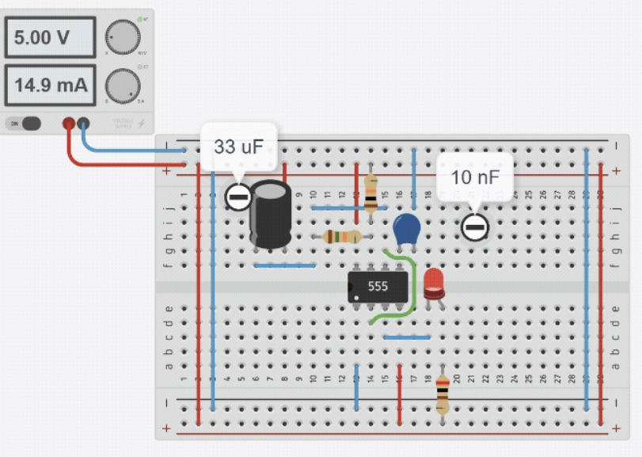
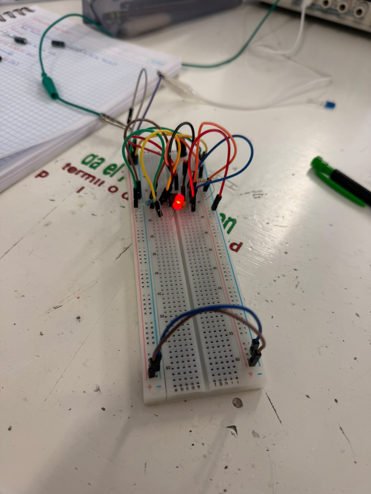
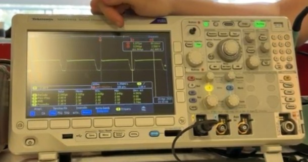

# Sesion 2 - 555 en astable (LED parpadeante)
## 2026/08/28
## Mauro Guzmán Morales 

# Sesión 2 - C.I. 555
## Que deberia de lograr hoy 
Durante esta sesion se deberia aprender el funcionamineto de el circuito integrado 555, y llegar a realizar un circuito con ayuda del profesor para tener conocimientos previos y poder aplicarlos para eol armado del proyecto final 

- Objetivo: 
\
Construir un oscilador que haga parpadear un LED, calcular su frecuencia y duty teóricos, medirlos y comparar.
---
## Que usamos 
- 1 × NE555 (DIP-8)
\
- 1 × LED
\
- 1 × Resistor para LED (330 Ω o 470 Ω)
\
- 2 × Resistores temporizadores
\
- 1 × Capacitor de temporización: 
 (electrolítico) y otro de 
 (cerámico) para el experimento rápido
 \
- 1 × Capacitor 10 nF para pin 5 
--- 
## Que hicimso y que paso 
- Figura uno circuito simulado

---
- Figura dos circuito realizado fisicamente 

---
- Lectura de señales electricas en osiloscopio, con ayuda del profesor

---

## Que fallo y como se soluciono 
Durante la realización de esta practica no hubo errores, pero por lo mismo, se aprendio mas al poder ayudar o dar consejos a compañeros con dudas, o incluso cosas que se quedaron con dudas, preguntamos al profesos para no quedarnos sin una respuesta segura y confiable.

## Que aprendi 
En esta sesión comprendí el funcionamiento del C.I. 555 en modo astable. Aprendí a calcular matemáticamente su frecuencia y ciclo de trabajo, para luego armar el circuito y hacer parpadear un LED. Con la ayuda del profesor, usamos el osciloscopio para medir y comprobar que las señales reales coincidieran con la teoría. Además, al no tener fallas en nuestro circuito, pude reafirmar mis conocimientos ayudando a mis compañeros a resolver sus dudas.