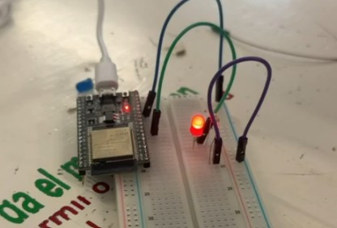
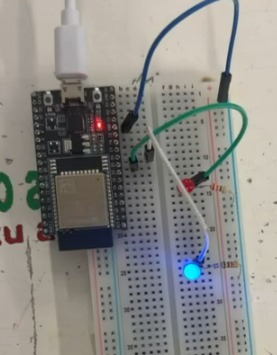

# Sesión 3 - Funcionamiento de ESP32
## 2026/08/28
## Mauro Guzmán Morales 

# Sesión 3 - GPIO
## Que deberia de lograr hoy
Durante esta sesion se tendria que lograr comprender el funcionamiento de un microcontrolador ESP32.

- Objetivo: 
Configurar el entorno de desarrollo del ESP32, controlar entradas y salidas digitales (LED, botón con pull-up y antirrebote) y establecer comunicación Bluetooth con un protocolo de comandos — la base del cerebro y el control remoto de tu carro.
---
## Que usamos 

- Tarjeta: ESP32 DevKit V1 (WROOM-32). 
- Cable: USB de datos.
- Breadboard 
- Jumpers.
- LED
- Resistor 220 Ω.
- Botón: 1 (push button).
- Arduino IDE + Paquete de tarjetas ESP32.
- VS Code + Extensión Arduino.
---
## Que hice y que paso 
- Codigo de blink con boton interno
``` codigo
void setup() {
    pinMode(23, OUTPUT);
    pinMode(24, INPUT_PULLUP); // pull-up interno: reposo = HIGH
}

void loop() {
    // Lógica invertida: presionado = LOW
    if (digitalRead(24) == LOW) {
        digitalWrite(23);
    } else {
        digitalWrite(23, LOW);
    }
}
```



- En la figura 1, se puede observar el pirmer circuito armado constaba de un parpadeo de un led color rojo.



- En la figura 2, se puede observar el segundo circuito donde constaba de un parpadeo intermitente del led rojo y posteriorente el led azul.

---
## Que fallo y como se resolvio

Durante el desarrollo de los circuitos hubieron ciertas complicaciones, pero fueron errores minimos, si fallo en el codigo o conecciones. 