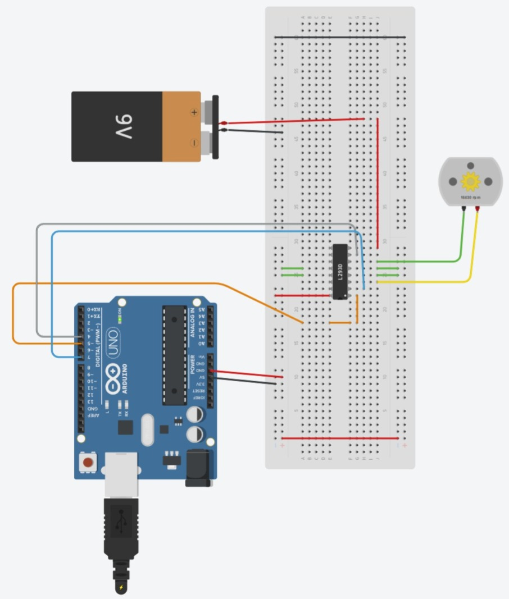

# Sesion 4 - Control de motores CC
## 2026/09/11
## Mauro Guzmán Morales 

# Sesion 4 - Motores CC
## Que deberiamos lograr hoy 
Identificar el funcionamiento de los motores CC ademas de caracteristicas basicas y por ultimo lograr realizar una simulación de un circuito basico.

- Objetivo: 
Configurar y controlar motores de corriente continua mediante arduino y el controlador L293D, comprendiendo su funcionamiento y la forma en que permiten controlar el movimiento de un vehiculo
---
## Que usamos 
- Arduino UNO
- Controlador L293D
- Motores CC 
- Servomotores
- Computadora
---
## Que hice y que paso 
- En este primer circuito se busco contorlar el movimiento de los motores, y identificar la dirección.


---
- Codigo primer figura.
 
````codigo 
void setup()
{
 pinMode(7, OUTPUT); // declaramos el pin 7 como salida
 pinMode(4, OUTPUT); // declaramos el pin 8 como salida
}
void secuencia() // función que realiza la secuencia de movimiento del motor
{
digitalWrite (7, HIGH);
digitalWrite (4,LOW);
delay (5000);
digitalWrite (7, LOW);
digitalWrite (4,LOW);
delay (2000);
digitalWrite (7, LOW);
digitalWrite (4,HIGH);
delay (5000);
digitalWrite (7, LOW);
digitalWrite (4,LOW);
delay (2000);
}
void loop()
{
analogWrite (5, 255);
secuencia();}
````
---


- Como segunda imagen contamos con un circuito compuesto por dos Motores CC y un servomotor, en los que los motores cuentan con una funcion de ir hacia adelante, atras, y que girarian a la derecha asi como la izquierda al igual que el servomotor girando en diferentes angulos, 0, 90 y 180. 
---
- Codigo del segundo circuito, con movimientos a la derecha, izquierda y giros.

```` codigo 
// C++ code
//
#include <Servo.h>
Servo MGM;

void adelante () {
   digitalWrite(6, HIGH);
  digitalWrite(7, LOW);
  
  digitalWrite(10,HIGH);
  digitalWrite(9,LOW);
  
}
void atras (){
  digitalWrite(7, HIGH);
  digitalWrite(6, LOW);
  
  digitalWrite(9,HIGH);
  digitalWrite(10,LOW);
  
}
void der(){
  digitalWrite(6, HIGH);
  digitalWrite(7, LOW);
  
  digitalWrite(9,HIGH);
  digitalWrite(10,LOW);

}

void izq(){
  digitalWrite(7, HIGH);
  digitalWrite(6, LOW);
  
  digitalWrite(10,HIGH);
  digitalWrite(9,LOW);

}
void setup()
{
  //servo
  MGM.attach(8);
   
    pinMode(6, OUTPUT);
    pinMode(7, OUTPUT);
    pinMode(2, OUTPUT);
  
  	pinMode(9, OUTPUT);
  	pinMode(10, OUTPUT);
    pinMode(12, OUTPUT);
  
  digitalWrite(2,HIGH);
  digitalWrite(12,HIGH);
}

void loop()
{
  
  MGM.write(0);
  adelante();
  delay(1000);
  atras();
  delay(1000);
  
  MGM.write(90);
  der();
  delay(1000);
  
  MGM.write(180);
  izq();
  delay(1000);
    
}
````
---
## Que fallo y como se resolvio 
Durante la realizacion de los circuitos no hubo casi erores, mas que de codigo del Arduino, durante estos errores, se fue modificando el codigo para diferentes funcionamientos y nececidades de la practica, en estas fu bajo el apoyo y revision del profesor.


